<div align="center">

 # InternPilot - AI 简历优化与求职助手

<p align="center">
  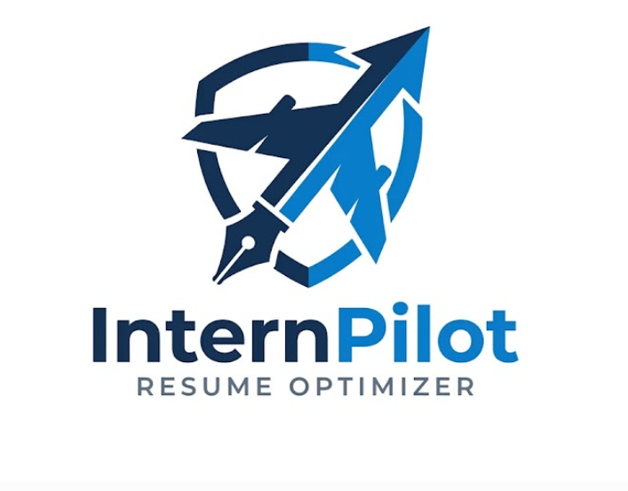
</p>

**基于大语言模型的智能简历分析与岗位匹配系统**

[](https://opensource.org/licenses/MIT)
[](https://www.python.org/)
[](https://vuejs.org/)
[](https://fastapi.tiangolo.com/)

[功能特性](#-功能特性) • [快速开始](#-快速开始) • [技术架构](#-技术架构) • [功能截图](#-功能截图) • [开发文档](#-开发文档)

</div>

---

## 📋 项目简介

**InternPilot** 是一个面向求职者（特别是学生和应届毕业生）的 AI 求职辅助工具，通过大语言模型技术提供智能简历优化、岗位匹配分析和个性化求职建议，帮助用户提高实习/全职申请的成功率。

### 🎯 核心价值

- **🔍 智能解析** - 自动解析 PDF/Word/Markdown 格式简历，提取关键信息
- **🎯 精准匹配** - AI 深度分析简历与岗位需求的契合度，给出量化评分
- **✨ 个性优化** - 根据目标岗位生成针对性的简历增强建议和优化方案
- **📊 批量分析** - 集成 BOSS 直聘爬虫，聚合分析多个岗位的共性要求
- **💡 智能生成** - 自动生成自我介绍、求职信、投递邮件等求职材料

### 🌟 项目亮点


- ✅ **前后端分离** - Vue 3 + FastAPI 现代化技术栈
- ✅ **开箱即用** - 一键启动脚本，SQLite 零配置数据库
- ✅ **LLM 驱动** - 支持 OpenAI、DeepSeek、智谱等多种大模型
- ✅ **实时交互** - 流式输出（SSE）提供即时反馈
- ✅ **完整闭环** - 从简历上传到优化建议的完整工作流

---

## ✨ 功能特性

### 🎨 主要功能

<table>
  <tr>
    <td width="50%" valign="top">
      <h4>📄 简历智能解析</h4>
      <ul>
        <li>支持 PDF、Word、Markdown 多种格式</li>
        <li>自动提取个人信息、教育背景、技能栈</li>
        <li>识别项目经历、工作经验、获奖情况</li>
        <li>生成结构化数据和 Markdown 预览</li>
      </ul>
    </td>
    <td width="50%" valign="top">
      <h4>📝 岗位需求分析</h4>
      <ul>
        <li>粘贴 JD 文本即可智能解析</li>
        <li>识别必备技能 vs 加分项</li>
        <li>提取岗位关键词和职责描述</li>
        <li>分析学历、经验等硬性要求</li>
      </ul>
    </td>
  </tr>
  <tr>
    <td width="50%" valign="top">
      <h4>🎯 智能匹配分析</h4>
      <ul>
        <li>简历与 JD 深度匹配分析</li>
        <li>生成 0-100 分匹配度评分</li>
        <li>详细列出优势、劣势、差距</li>
        <li>给出可操作的改进建议</li>
      </ul>
    </td>
    <td width="50%" valign="top">
      <h4>✨ 简历增强建议</h4>
      <ul>
        <li>根据岗位要求调整简历重点</li>
        <li>优化项目描述和技能措辞</li>
        <li>建议可补充的经历和成果</li>
        <li>生成 Markdown 格式优化报告</li>
      </ul>
    </td>
  </tr>
</table>

### 🚀 高级功能


- **🕷️ BOSS 直聘职位爬取** - 关键词搜索，批量抓取职位信息
- **📊 批量职位聚合分析** - 从多条 JD 中提取高频技能和共性要求
- **💼 通用简历优化** - 面向一批岗位的综合优化方案
- **📝 简历版本管理** - 保存和对比不同版本的简历
- **📜 历史记录查询** - 查看过往分析记录和优化建议
- **📤 简历导出功能** - 导出优化后的简历为 PDF/Word 格式

---

## 🏗️ 技术架构

### 📦 项目结构

```
InternPilot/
├── 📁 intern-pilot-web/          # Vue 3 前端应用
│   ├── src/
│   │   ├── api/                  # API 接口封装
│   │   ├── components/           # 公共组件
│   │   ├── views/                # 页面组件
│   │   │   ├── HomeView.vue      # 首页
│   │   │   ├── ResumeView.vue    # 简历管理
│   │   │   ├── JDView.vue        # JD 管理
│   │   │   ├── AnalysisView.vue  # 匹配分析
│   │   │   └── BatchAnalysisView.vue  # 批量分析
│   │   ├── stores/               # Pinia 状态管理
│   │   └── types/                # TypeScript 类型
│   ├── package.json
│   └── vite.config.ts
│
├── 📁 intern-pilot-api/          # FastAPI 后端服务
│   ├── app/
│   │   ├── api/                  # API 路由
│   │   │   ├── auth.py           # 用户认证
│   │   │   ├── resume.py         # 简历管理
│   │   │   ├── jd.py             # 岗位需求
│   │   │   ├── match.py          # 匹配分析
│   │   │   ├── batch_analysis.py # 批量分析
│   │   │   └── resume_optimization.py  # 简历优化
│   │   ├── services/             # 业务服务层
│   │   │   ├── llm_service.py    # LLM 调用
│   │   │   ├── resume_service.py # 简历处理
│   │   │   └── parser_service.py # 文档解析
│   │   ├── models/               # 数据模型
│   │   ├── core/                 # 核心配置
│   │   └── database/             # 数据库管理
│   ├── main.py                   # 应用入口
│   └── requirements.txt
│
├── 📁 boss-job-crawler/          # BOSS 直聘爬虫工具
│   ├── boss_crawler/             # 爬虫核心库
│   │   ├── crawler.py            # 爬虫逻辑
│   │   ├── parser.py             # 页面解析
│   │   └── controller.py         # 控制器
│   └── gui/                      # PySide6 GUI
│
├── 📁 docs/                      # 项目文档
│   ├── internpilot-requirements-analysis.md
│   └── InternPilot技术实现方案-深度版.md
│
├── 📁 uploads/                   # 上传文件存储
├── start-all.bat                 # 一键启动脚本
├── start-backend.bat             # 后端启动脚本
├── start-frontend.bat            # 前端启动脚本
└── init-database.bat             # 数据库初始化脚本
```

### 🛠️ 技术栈

<table>
  <tr>
    <th>分类</th>
    <th>技术</th>
    <th>版本</th>
    <th>说明</th>
  </tr>
  <tr>
    <td rowspan="6"><strong>前端</strong></td>
    <td><a href="https://vuejs.org/">Vue 3</a></td>
    <td>3.5+</td>
    <td>渐进式 JavaScript 框架（Composition API）</td>
  </tr>
  <tr>
    <td><a href="https://www.typescriptlang.org/">TypeScript</a></td>
    <td>6.0+</td>
    <td>类型安全的 JavaScript 超集</td>
  </tr>
  <tr>
    <td><a href="https://vitejs.dev/">Vite</a></td>
    <td>8.0+</td>
    <td>下一代前端构建工具</td>
  </tr>
  <tr>
    <td><a href="https://www.naiveui.com/">Naive UI</a></td>
    <td>2.44+</td>
    <td>Vue 3 组件库，现代化设计风格</td>
  </tr>
  <tr>
    <td><a href="https://pinia.vuejs.org/">Pinia</a></td>
    <td>3.0+</td>
    <td>Vue 官方推荐的状态管理库</td>
  </tr>
  <tr>
    <td><a href="https://axios-http.com/">Axios</a></td>
    <td>1.16+</td>
    <td>基于 Promise 的 HTTP 客户端</td>
  </tr>
</table>


<table>
  <tr>
    <th>分类</th>
    <th>技术</th>
    <th>版本</th>
    <th>说明</th>
  </tr>
  <tr>
    <td rowspan="7"><strong>后端</strong></td>
    <td><a href="https://fastapi.tiangolo.com/">FastAPI</a></td>
    <td>0.109+</td>
    <td>现代、高性能的 Python Web 框架</td>
  </tr>
  <tr>
    <td><a href="https://docs.pydantic.dev/">Pydantic</a></td>
    <td>2.5+</td>
    <td>数据验证和设置管理</td>
  </tr>
  <tr>
    <td><a href="https://www.sqlalchemy.org/">SQLAlchemy</a></td>
    <td>2.0+</td>
    <td>Python SQL 工具包和 ORM</td>
  </tr>
  <tr>
    <td><a href="https://www.sqlite.org/">SQLite</a> / <a href="https://www.postgresql.org/">PostgreSQL</a></td>
    <td>-</td>
    <td>数据库（开发/生产）</td>
  </tr>
  <tr>
    <td><a href="https://platform.openai.com/docs/api-reference">OpenAI API</a></td>
    <td>1.12+</td>
    <td>大语言模型 API 客户端</td>
  </tr>
  <tr>
    <td><a href="https://github.com/pymupdf/PyMuPDF">PyMuPDF4LLM</a></td>
    <td>latest</td>
    <td>PDF 文档解析转 Markdown</td>
  </tr>
  <tr>
    <td><a href="https://python-docx.readthedocs.io/">python-docx</a></td>
    <td>1.1+</td>
    <td>Word 文档处理</td>
  </tr>
  <tr>
    <td rowspan="2"><strong>爬虫</strong></td>
    <td><a href="https://www.drissionpage.cn/">DrissionPage</a></td>
    <td>latest</td>
    <td>浏览器自动化框架</td>
  </tr>
  <tr>
    <td><a href="https://doc.qt.io/qtforpython-6/">PySide6</a></td>
    <td>latest</td>
    <td>Qt for Python，GUI 开发</td>
  </tr>
</table>

---

## 🚀 快速开始

### 📋 环境要求


在开始之前，请确保您的系统已安装：

- **Python** 3.9 或更高版本 ([下载链接](https://www.python.org/downloads/))
- **Node.js** 18.0 或更高版本 ([下载链接](https://nodejs.org/))
- **Git** (可选，用于克隆仓库) ([下载链接](https://git-scm.com/))
- **操作系统**: Windows 10/11、macOS、Linux

### ⚡ 方式一：一键启动（推荐）

适合 Windows 用户快速体验，无需手动配置。

#### 1️⃣ 克隆项目

```bash
git clone https://github.com/your-username/InternPilot.git
cd InternPilot
```

#### 2️⃣ 初始化数据库

运行数据库初始化脚本，选择 SQLite（开发环境）或 PostgreSQL（生产环境）：

```bash
init-database.bat
# 根据提示选择：1 (SQLite) 用于开发测试
```

#### 3️⃣ 配置 LLM API Key

编辑 `intern-pilot-api/.env` 文件，填写你的大模型 API Key：

```env
# 使用 OpenAI
LLM_PROVIDER=openai
OPENAI_API_KEY=sk-your-openai-api-key
OPENAI_MODEL=gpt-4

# 或使用 DeepSeek（推荐，性价比高）
# LLM_PROVIDER=deepseek
# DEEPSEEK_API_KEY=your-deepseek-api-key

# 或使用智谱 AI（国内稳定）
# LLM_PROVIDER=zhipu
# ZHIPU_API_KEY=your-zhipu-api-key
```

> 💡 **获取 API Key**:
> - [OpenAI](https://platform.openai.com/api-keys) - GPT-4，效果最好
> - [DeepSeek](https://platform.deepseek.com/) - 价格便宜，性能优秀
> - [智谱 AI](https://open.bigmodel.cn/) - 免费额度，适合测试

#### 4️⃣ 一键启动

```bash
start-all.bat
```


该脚本会自动：
- 安装后端 Python 依赖
- 安装前端 npm 依赖
- 启动后端服务（http://localhost:8000）
- 启动前端应用（http://localhost:5173）

#### 5️⃣ 访问应用

打开浏览器访问：

- **前端应用**: [http://localhost:5173](http://localhost:5173)
- **API 文档**: [http://localhost:8000/docs](http://localhost:8000/docs)
- **健康检查**: [http://localhost:8000/health](http://localhost:8000/health)

---

### 🔧 方式二：手动启动

适合需要自定义配置的用户。

#### 后端启动

```bash
# 1. 进入后端目录
cd intern-pilot-api

# 2. 创建虚拟环境
python -m venv venv

# 3. 激活虚拟环境
# Windows PowerShell
.\venv\Scripts\Activate.ps1
# Windows CMD
.\venv\Scripts\activate.bat
# macOS/Linux
source venv/bin/activate

# 4. 安装依赖
pip install -r requirements.txt

# 5. 配置环境变量
# 复制 .env.example 为 .env 并填写配置
cp .env.example .env

# 6. 启动服务
python main.py
```

后端服务将在 `http://localhost:8000` 启动。

#### 前端启动

```bash
# 1. 进入前端目录
cd intern-pilot-web

# 2. 安装依赖
npm install

# 3. 启动开发服务器
npm run dev
```

前端应用将在 `http://localhost:5173` 启动。

---


## 📸 功能截图

### 首页

<div align="center">
  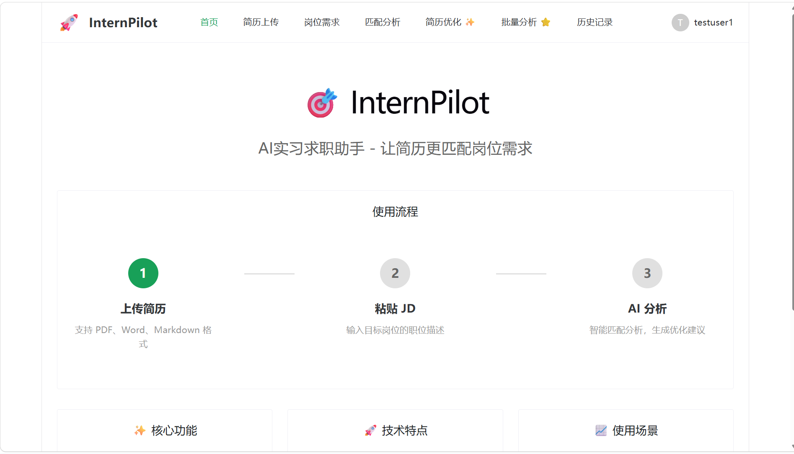
  <p><em>简洁直观的首页，快速开始求职优化流程</em></p>
</div>

### 简历上传与解析

<div align="center">
  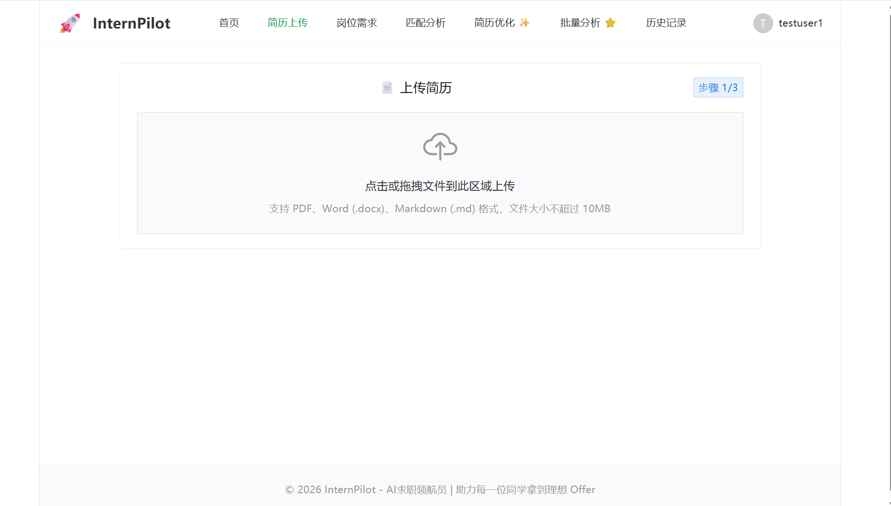
  <p><em>支持拖拽上传，自动解析 PDF/Word/Markdown 格式简历</em></p>
</div>

<div align="center">
  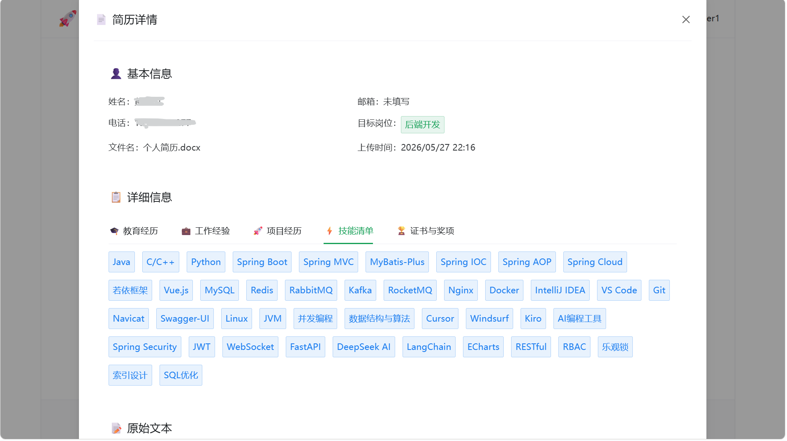
  <p><em>结构化展示简历信息，Markdown 格式预览</em></p>
</div>

### JD 岗位需求分析

<div align="center">
  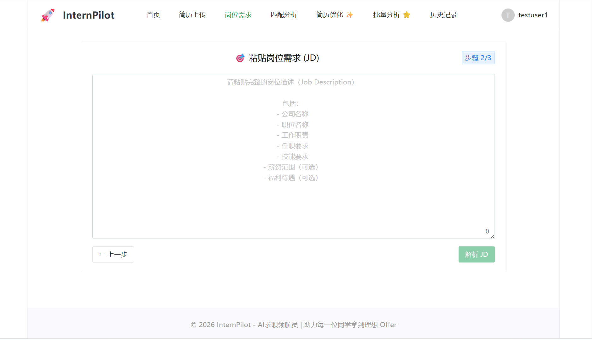
  <p><em>粘贴岗位描述，AI 自动解析岗位要求</em></p>
</div>

<div align="center">
  
  <p><em>智能提取必备技能、加分项和关键词</em></p>
</div>

### 匹配分析与简历增强

<div align="center">
  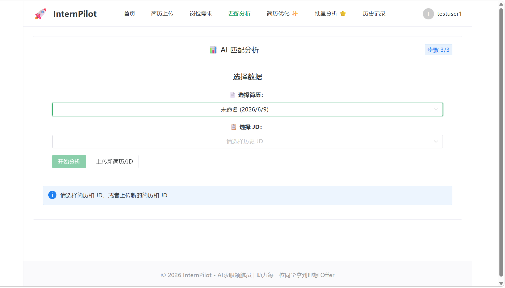
  <p><em>深度分析简历与岗位的匹配度，给出量化评分</em></p>
</div>

<div align="center">
  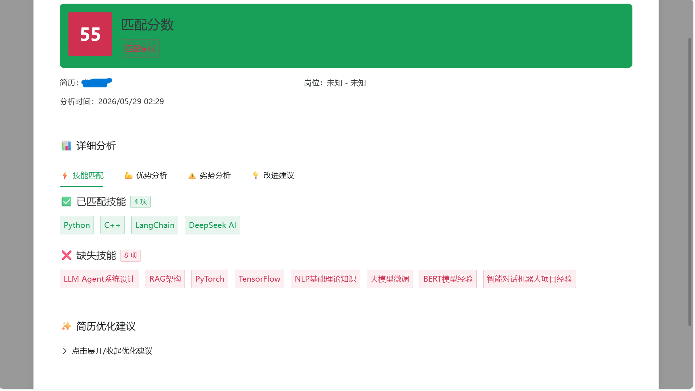
  <p><em>生成针对性的简历优化建议，支持 Markdown 导出</em></p>
</div>

### AI 简历优化编辑器

<div align="center">
  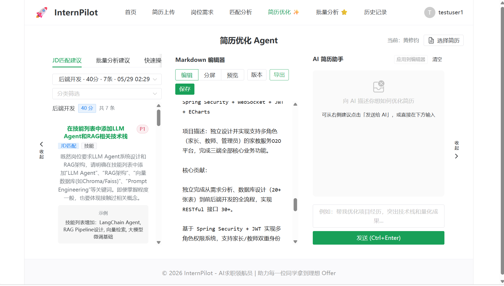
  <p><em>根据 AI 建议智能优化简历内容，实时预览优化效果</em></p>
</div>

<div align="center">
  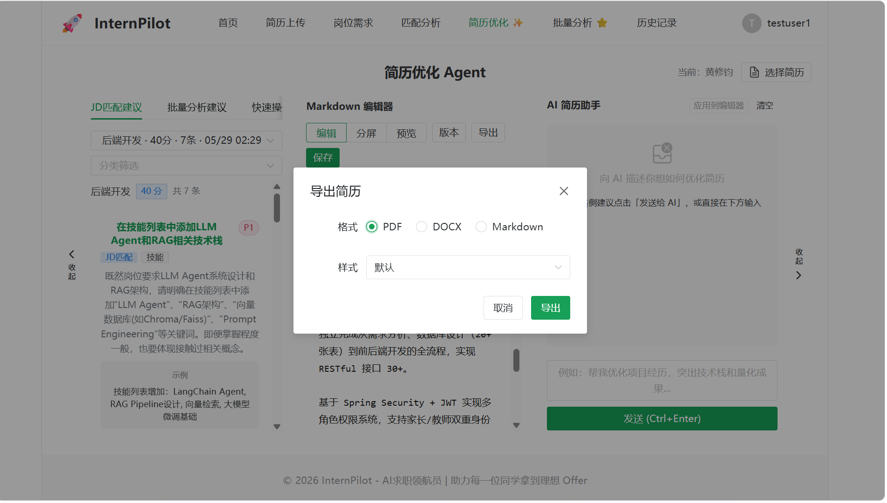
  <p><em>输出优化后的简历，支持版本对比和一键导出</em></p>
</div>

### 批量职位分析

<div align="center">
  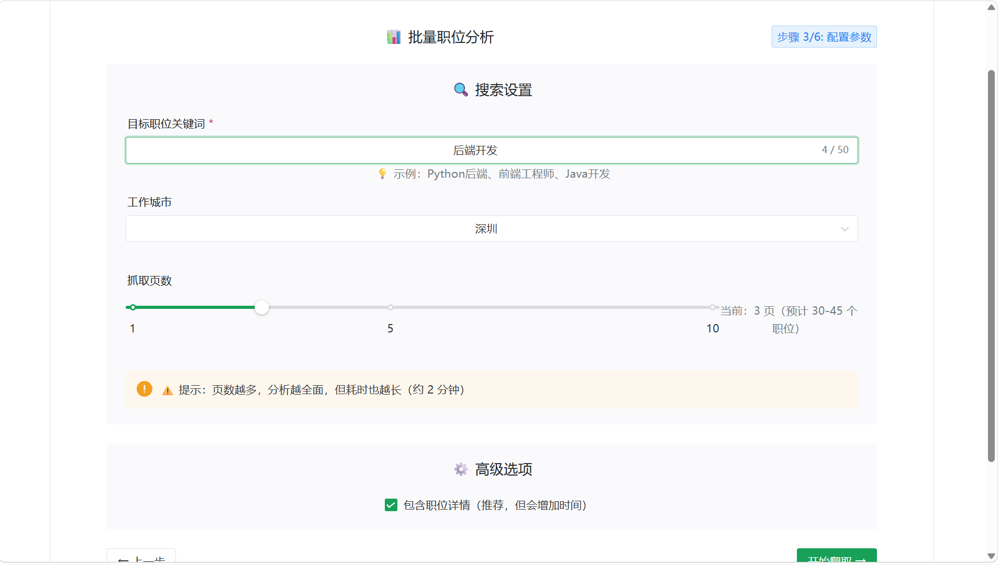
  <p><em>BOSS 直聘职位爬取，聚合分析多个岗位的共性要求</em></p>
</div>


### 历史记录管理

<div align="center">
  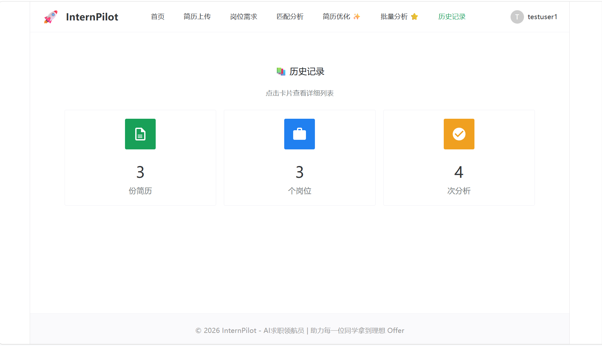
  <p><em>保存和查看历史分析记录，对比不同版本的优化方案</em></p>
</div>

---

## 🔑 配置说明

### 后端环境变量配置

创建 `intern-pilot-api/.env` 文件（可参考 `.env.example`）：

```env
# ==================== 数据库配置 ====================
DATABASE_TYPE=sqlite              # 数据库类型：sqlite 或 postgresql
SQLITE_DB_NAME=internpilot.db     # SQLite 数据库文件名

# PostgreSQL 配置（生产环境推荐）
# POSTGRES_HOST=localhost
# POSTGRES_PORT=5432
# POSTGRES_USER=postgres
# POSTGRES_PASSWORD=your_password
# POSTGRES_DB=internpilot

# ==================== LLM 配置 ====================
LLM_PROVIDER=openai               # LLM 提供商：openai, deepseek, zhipu
OPENAI_API_KEY=your_api_key_here  # OpenAI API Key
OPENAI_BASE_URL=https://api.openai.com/v1
OPENAI_MODEL=gpt-4                # 模型名称

# DeepSeek 配置（推荐，性价比高）
# LLM_PROVIDER=deepseek
# DEEPSEEK_API_KEY=your_deepseek_key
# DEEPSEEK_BASE_URL=https://api.deepseek.com/v1
# DEEPSEEK_MODEL=deepseek-chat

# 智谱 AI 配置（国内稳定）
# LLM_PROVIDER=zhipu
# ZHIPU_API_KEY=your_zhipu_key
# ZHIPU_BASE_URL=https://open.bigmodel.cn/api/paas/v4/
# ZHIPU_MODEL=glm-4

# ==================== 应用配置 ====================
DEBUG=True                        # 调试模式
HOST=0.0.0.0                      # 服务器地址
PORT=8000                         # 服务器端口
CORS_ORIGINS=http://localhost:5173  # 允许的跨域源

# ==================== 文件上传 ====================
UPLOAD_DIR=uploads                # 上传文件目录
MAX_FILE_SIZE=10485760            # 最大文件大小（10MB）
```


### 数据库选择

#### SQLite（开发/MVP 推荐）

✅ **优势**:
- 零配置，开箱即用
- 无需安装数据库服务器
- 适合单用户/小规模使用
- 数据库文件便于备份和迁移

📝 **使用方式**: 运行 `init-database.bat` 选择选项 1 (SQLite)

#### PostgreSQL（生产环境推荐）

✅ **优势**:
- 高性能，支持高并发
- 丰富的数据类型和扩展功能
- 适合多用户/大规模部署
- 更好的数据完整性和安全性

📝 **配置步骤**:
1. 安装 PostgreSQL ([下载链接](https://www.postgresql.org/download/))
2. 创建数据库：`CREATE DATABASE internpilot;`
3. 在 `.env` 中配置 PostgreSQL 连接信息
4. 运行 `init-database.bat` 选择选项 2 (PostgreSQL)

---

## 📖 API 接口文档

启动后端服务后，访问 [http://localhost:8000/docs](http://localhost:8000/docs) 查看完整的 Swagger API 文档。

### 核心接口列表

| 分类 | 方法 | 路径 | 说明 |
|------|------|------|------|
| **系统** | GET | `/health` | 健康检查 |
| **用户认证** | POST | `/api/auth/register` | 用户注册 |
| **用户认证** | POST | `/api/auth/login` | 用户登录 |
| **简历管理** | POST | `/api/resume/upload` | 上传简历文件 |
| **简历管理** | POST | `/api/resume/parse/{resume_id}` | 解析简历 |
| **简历管理** | GET | `/api/resume/{resume_id}` | 获取简历详情 |
| **简历管理** | GET | `/api/resume/list` | 获取简历列表 |
| **岗位需求** | POST | `/api/jd/parse` | 解析 JD 文本 |
| **岗位需求** | GET | `/api/jd/{jd_id}` | 获取 JD 详情 |
| **岗位需求** | GET | `/api/jd/list` | 获取 JD 列表 |
| **匹配分析** | POST | `/api/match/analyze` | 简历与 JD 匹配分析 |
| **匹配分析** | POST | `/api/match/enhance` | 生成简历增强建议 |
| **批量分析** | POST | `/api/batch-analysis/start` | 启动批量爬取任务 |
| **批量分析** | GET | `/api/batch-analysis/{task_id}/status` | 查询任务状态 |

| **批量分析** | GET | `/api/batch-analysis/{task_id}/jobs` | 获取爬取的职位列表 |
| **简历优化** | POST | `/api/resume-optimization/chat` | 与 AI 对话优化简历 |
| **历史记录** | GET | `/api/history/analyses` | 获取分析历史记录 |
| **BOSS登录** | GET | `/api/boss/login/status` | 检查 BOSS 登录状态 |

### 请求示例

#### 上传并解析简历

```bash
# 1. 上传简历
curl -X POST "http://localhost:8000/api/resume/upload" \
  -H "Content-Type: multipart/form-data" \
  -F "file=@resume.pdf"

# 响应: {"resume_id": "uuid-here", "filename": "resume.pdf"}

# 2. 解析简历
curl -X POST "http://localhost:8000/api/resume/parse/{resume_id}"

# 响应: 结构化的简历数据（JSON 格式）
```

#### 解析 JD 并进行匹配分析

```bash
# 1. 解析 JD
curl -X POST "http://localhost:8000/api/jd/parse" \
  -H "Content-Type: application/json" \
  -d '{"jd_text": "招聘 Python 后端工程师..."}'

# 响应: {"jd_id": "uuid-here", "parsed_data": {...}}

# 2. 匹配分析
curl -X POST "http://localhost:8000/api/match/analyze" \
  -H "Content-Type: application/json" \
  -d '{"resume_id": "uuid1", "jd_id": "uuid2"}'

# 响应: 匹配分析报告（包含评分、优劣势、建议）
```

---

## 📚 开发文档

### 项目文档

- 📋 [需求分析文档](docs/internpilot-requirements-analysis.md) - 详细的功能需求和用户场景
- 🏗️ [技术实现方案](docs/InternPilot技术实现方案-深度版.md) - 架构设计和技术选型
- 📊 [API 接口文档](http://localhost:8000/docs) - Swagger 自动生成的接口文档


### 技术资源

#### 前端技术

- [Vue 3 官方文档](https://vuejs.org/) - 渐进式 JavaScript 框架
- [TypeScript 官方文档](https://www.typescriptlang.org/) - JavaScript 的超集
- [Vite 官方文档](https://vitejs.dev/) - 下一代前端构建工具
- [Naive UI 组件库](https://www.naiveui.com/) - Vue 3 组件库
- [Pinia 状态管理](https://pinia.vuejs.org/) - Vue 官方状态管理库
- [VueUse 工具集](https://vueuse.org/) - Vue Composition API 工具集

#### 后端技术

- [FastAPI 官方文档](https://fastapi.tiangolo.com/) - 现代 Python Web 框架
- [Pydantic 文档](https://docs.pydantic.dev/) - 数据验证库
- [SQLAlchemy 文档](https://www.sqlalchemy.org/) - Python ORM
- [Uvicorn 文档](https://www.uvicorn.org/) - ASGI 服务器

#### AI/LLM 技术

- [OpenAI API 文档](https://platform.openai.com/docs/api-reference) - GPT 系列模型
- [DeepSeek 文档](https://platform.deepseek.com/api-docs/) - 国产高性价比大模型
- [智谱 AI 文档](https://open.bigmodel.cn/dev/api) - GLM 系列模型
- [LangChain 文档](https://python.langchain.com/) - LLM 应用开发框架（可选）

#### 文档处理

- [PyMuPDF4LLM](https://github.com/pymupdf/PyMuPDF) - PDF 转 Markdown
- [python-docx](https://python-docx.readthedocs.io/) - Word 文档处理
- [markdown-it](https://markdown-it.github.io/) - Markdown 解析器

---

## 🎯 开发路线图

### ✅ Sprint 0: 项目脚手架（已完成）

- [x] FastAPI 后端项目结构搭建
- [x] Vue 3 + TypeScript 前端项目初始化
- [x] Naive UI 组件库集成
- [x] 前后端联调和 API 文档生成
- [x] 基础路由和状态管理配置


### ✅ Sprint 1: 核心功能实现（已完成）

- [x] PDF/Word/Markdown 简历解析
- [x] LLM 结构化信息提取
- [x] JD 文本智能解析
- [x] 简历与 JD 匹配分析算法
- [x] 简历增强建议生成
- [x] SQLite 数据库集成

### ✅ Sprint 2: 前端完整开发（已完成）

- [x] 简历上传页面（拖拽上传、文件验证）
- [x] 简历解析结果展示（Markdown 预览）
- [x] JD 输入页面（文本框、一键解析）
- [x] 匹配分析页面（评分、优劣势、建议）
- [x] Markdown 渲染和导出功能
- [x] 响应式布局和交互优化

### 🚧 Sprint 3: 高级功能（进行中）

- [x] BOSS 直聘爬虫集成
- [x] 批量职位爬取功能
- [x] 批量职位聚合分析
- [ ] 简历版本管理和对比
- [ ] 历史记录查询和导出
- [ ] SSE 流式输出优化

### 📅 Sprint 4: 优化与增强（计划中）

- [ ] 用户系统和权限管理
- [ ] 简历模板库
- [ ] 自我介绍和求职信生成
- [ ] 面试准备建议（FAQ 生成）
- [ ] 数据可视化（匹配度趋势、技能缺口）
- [ ] 移动端适配
- [ ] 性能优化和缓存策略

### 🌟 Sprint 5: 生产部署（未来规划）

- [ ] Docker 容器化部署
- [ ] PostgreSQL 生产环境配置
- [ ] CI/CD 自动化部署流程
- [ ] 监控和日志系统（Sentry、ELK）
- [ ] 云服务部署（阿里云、腾讯云）


---

## 🤝 贡献指南

我们欢迎所有形式的贡献！无论是报告 bug、提出新功能建议，还是提交代码改进。

### 如何贡献

1. **Fork 本仓库**
2. **创建特性分支** (`git checkout -b feature/AmazingFeature`)
3. **提交更改** (`git commit -m 'Add some AmazingFeature'`)
4. **推送到分支** (`git push origin feature/AmazingFeature`)
5. **开启 Pull Request**

### 提交规范

我们建议使用以下提交信息格式：

```
<type>(<scope>): <subject>

<body>

<footer>
```

**Type 类型**:
- `feat`: 新功能
- `fix`: 修复 bug
- `docs`: 文档更新
- `style`: 代码格式调整（不影响功能）
- `refactor`: 代码重构
- `test`: 测试相关
- `chore`: 构建/工具链更新

**示例**:
```
feat(resume): 添加 Word 文档解析支持

- 集成 python-docx 库
- 实现 .docx 文件解析逻辑
- 添加单元测试

Closes #123
```

---

## ❓ 常见问题

### Q1: 启动时提示 "LLM API Key 未配置"？

**A**: 请检查 `intern-pilot-api/.env` 文件是否存在，并确保已正确配置 LLM API Key：

```env
LLM_PROVIDER=openai
OPENAI_API_KEY=sk-your-actual-api-key-here
```

### Q2: 简历解析失败或结果不准确？

**A**: 
- 确保上传的是文本型 PDF（非扫描件）
- 简历格式尽量规范（清晰的标题、段落结构）
- 可尝试将简历转换为 Markdown 格式后重新上传


### Q3: BOSS 直聘爬虫无法使用？

**A**: 
- 批量爬取功能需要先登录 BOSS 直聘网站
- 确保浏览器配置正确（ChromeDriver 或 EdgeDriver）
- 遵守网站 robots.txt 和相关规定，避免过度频繁请求

### Q4: 前端访问后端 API 出现跨域错误？

**A**: 
- 检查后端 `.env` 中的 `CORS_ORIGINS` 配置
- 确保包含前端地址：`CORS_ORIGINS=http://localhost:5173`
- 重启后端服务使配置生效

### Q5: 数据库迁移失败？

**A**: 
- 删除旧的数据库文件：`intern-pilot-api/internpilot.db`
- 重新运行 `init-database.bat`
- 或使用 Alembic 进行数据库迁移（参考文档）

### Q6: 如何更换大模型提供商？

**A**: 修改 `.env` 文件中的 `LLM_PROVIDER` 和对应的 API Key：

```env
# 从 OpenAI 切换到 DeepSeek
LLM_PROVIDER=deepseek
DEEPSEEK_API_KEY=your-deepseek-key
DEEPSEEK_BASE_URL=https://api.deepseek.com/v1
DEEPSEEK_MODEL=deepseek-chat
```

---

## ⚠️ 免责声明

- 本项目仅供**学习交流**使用，不得用于商业目的
- BOSS 直聘爬虫功能请遵守网站 [robots.txt](https://www.zhipin.com/robots.txt) 及相关法律法规
- 使用爬虫功能时请**合理控制频率**，避免对目标网站造成负担
- 用户数据和简历信息请妥善保管，注意**隐私安全**
- 大模型生成的内容仅供参考，**最终决策请自行判断**

---

## 📄 开源许可

本项目采用 [MIT License](LICENSE) 开源协议。

```
MIT License

Copyright (c) 2024 InternPilot Contributors

Permission is hereby granted, free of charge, to any person obtaining a copy
of this software and associated documentation files (the "Software"), to deal
in the Software without restriction...
```


---

## 🙏 致谢

感谢以下开源项目和服务：

- [FastAPI](https://fastapi.tiangolo.com/) - 高性能 Web 框架
- [Vue.js](https://vuejs.org/) - 渐进式 JavaScript 框架
- [Naive UI](https://www.naiveui.com/) - 优雅的 Vue 3 组件库
- [OpenAI](https://openai.com/) - 提供强大的大语言模型
- [DeepSeek](https://www.deepseek.com/) - 高性价比的国产大模型
- [DrissionPage](https://www.drissionpage.cn/) - 浏览器自动化框架
- 所有为本项目做出贡献的开发者们 ❤️

---

## 📞 联系方式

- **项目地址**: [https://github.com/your-username/InternPilot](https://github.com/your-username/InternPilot)
- **问题反馈**: [Issues](https://github.com/your-username/InternPilot/issues)
- **讨论交流**: [Discussions](https://github.com/your-username/InternPilot/discussions)

---

## 🎯 项目愿景

InternPilot 的目标不仅是帮助求职者提高申请成功率，更希望通过技术手段：

1. **降低求职门槛** - 让每个人都能获得专业的简历优化建议
2. **提升求职效率** - 批量分析和智能匹配节省大量时间
3. **数据驱动决策** - 基于真实岗位需求优化求职策略
4. **持续学习成长** - 通过项目实践掌握前沿技术栈

---

<div align="center">

### 🚀 让 AI 成为你的求职导师

**开始使用 InternPilot，早日拿到心仪的 Offer！**

[](https://github.com/your-username/InternPilot)
[](https://github.com/your-username/InternPilot/fork)

---

Made with ❤️ by InternPilot Contributors

</div>
